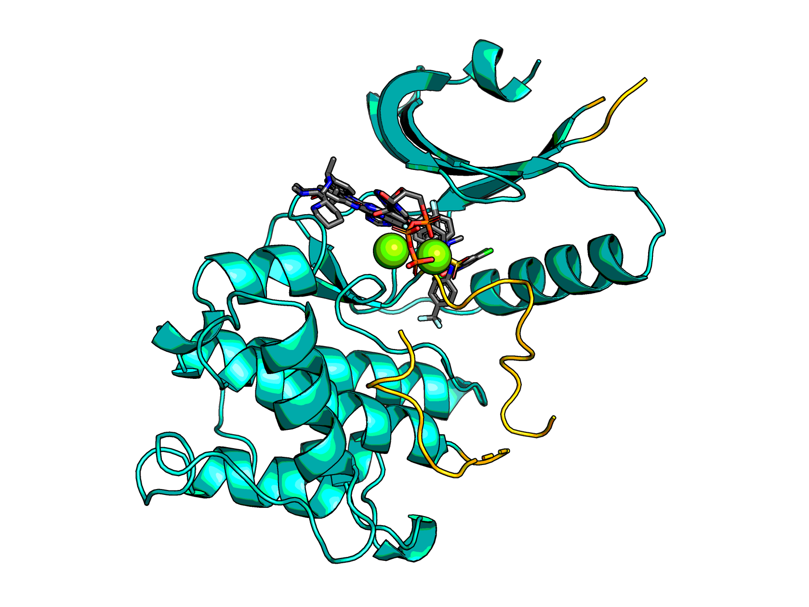
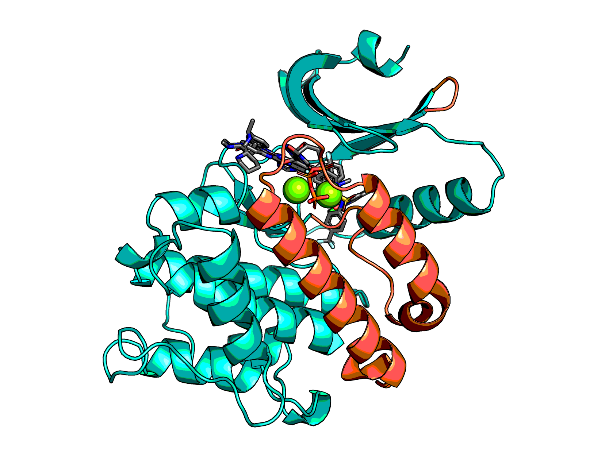
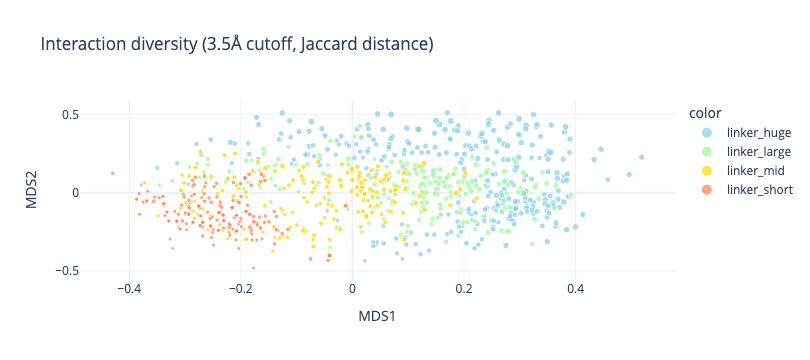
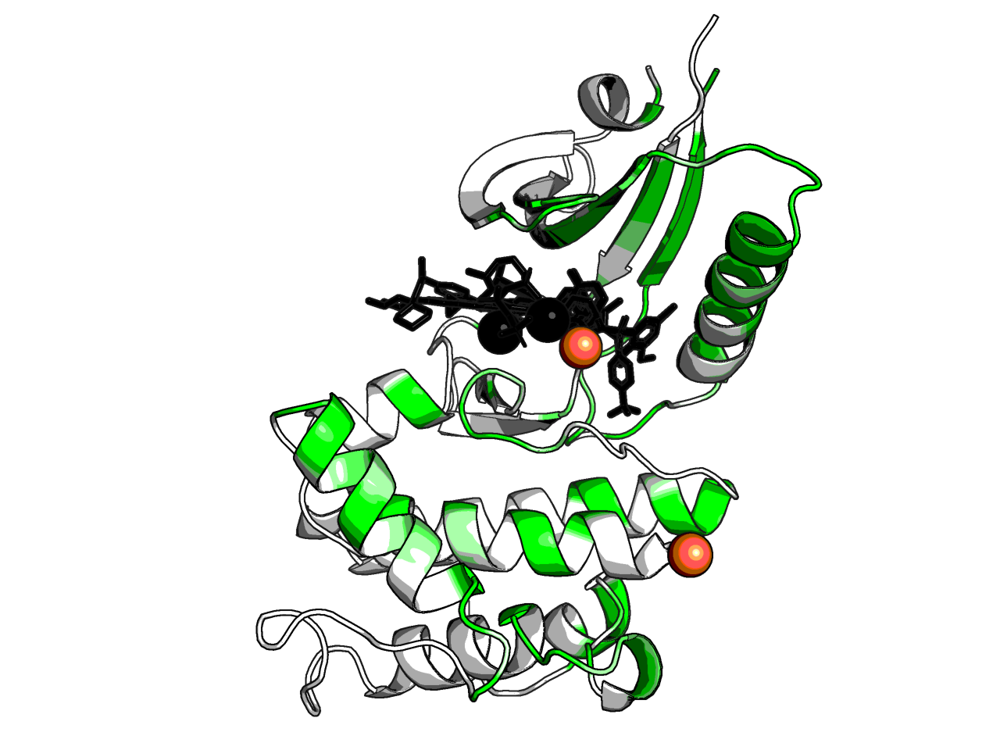
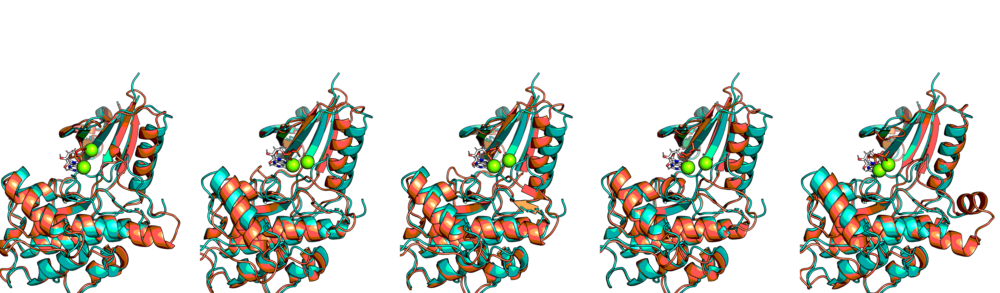
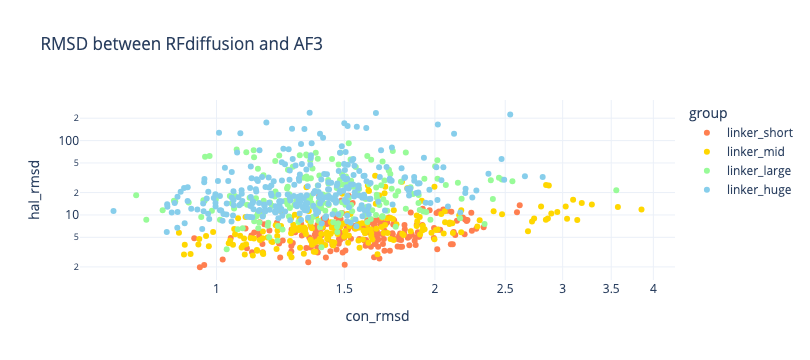
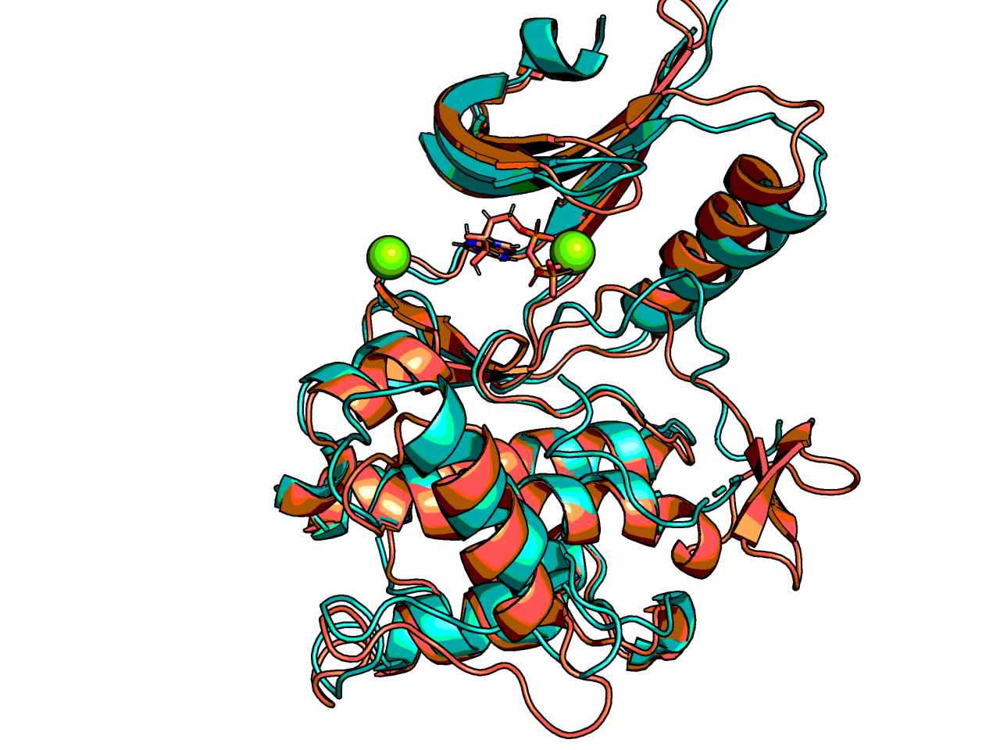
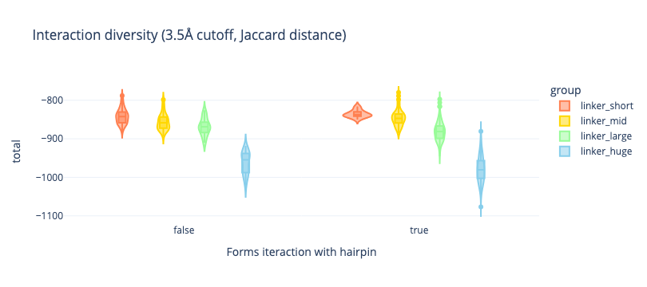
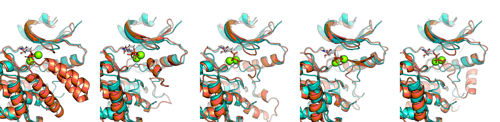

# GCN2-open-state

> This is a proof-of-concept test, using GCN2 kinases as a test case, to see how to force the open state
> of something simple before using a complex system.
> It was not tested experimentally and actually has a blunder (DFG motif deleted).

This protein was mentioned to me as it was a project that could not be progressed by
crystallographic fragment-based screening due to the lack of a crystal structure in the open state.

GCN2 is a kinase that crystallises in the close state in the absence of ligands,
yet there are lots of structures with ligands in the open state.
Thefefore, a structure that does not have the active site occluded
and is in the open state is ideal.


### Prior structures

There are several structures of GCN2.

* Apo PDB:1ZYC is yeast and is at 3Å and the active site is poorly resolved —as is typical for unbound kinases.
* ATP-bound PDB:1ZYD is better, 2.75Å, but is occluded and is also yeast
* Human stuctures with drugs:
  * PDB:6N3L (2.6Å), 
  * PDB:6N3N (3Å), 
  * PDB:6N3O (2.4Å), 
  * PDB:7QQ6 (dovitinib, 2.8Å), 
  * PDB:7QWK (2.3Å).

As a template, PDB:6N3O is best choice: It is human, and is most consistent with yeast unlike PDB:7QWK.
PDB:6N3L would clash in PDB:6N3O to the mobile loop.

In terms of design,

* The span 866-921 is variable, noisy and often missing
* The span 658-796 is also missing



Therefore, the plan is to design a carjack insert like:




## Δ658–796 insert

1,000 designs of RFdiffusion were run for 2-5 residue insert for Δ658–796 (250 each length).
A beta-hairpin is all that is needed, but there may be preferred residues.
This is extreme overkill as the following appeared:

| Sequence | Count |
|----------|-------|
| DG       | 1254  |
| EEEG     | 380   |
| PSG      | 344   |
| EETG     | 244   |
| DDG      | 240   |
| EESG     | 166   |

## ∆866-921 insert

Four different length spans were done for the 866-921 region,
these were labelled `linker_short`, `linker_mid`, `linker_large` and `linker_huge`.
See [experiments.yaml](experiments.yaml) for contig definition.

* RFdiffusion
* ProteinMPNN x5
* Gemmi superposition and filtering against clash with prior small molecule binders
* Top ~500 non-clashing with best proteinMPNN global_score modelled with AlphaFold3
* PyRosetta minimised

### Interactions

The spread of interactions for these designs is large:





There are no obvious clusters etc, so no patterns to needed investigation.

### RMSD

A first filter is against large deviation between AF3-models vs RFdiffusion-models

Lowest RMSD AF3-models vs RFdiffusion-models were:


| design_name       |    total |   hal_rmsd |   n_designed |   loopiness |   n_intxns |   n_hairpin_itxns |   n_hairpin_side_itxns | camelized_sequence                                                                                                                                                                                                                                |
|:------------------|---------:|-----------:|-------------:|------------:|-----------:|------------------:|-----------------------:|:--------------------------------------------------------------------------------------------------------------------------------------------------------------------------------------------------------------------------------------------------|
| linker_short_383a | -875.865 |    2.31741 |            5 |           3 |         20 |                 0 |                      0 | sryfiefeelqllgkgafgavikvqnkldgccyavkripinpasrqfrrikgevtllsrlhhenivryynawienavhylyiqmeyceastlrdtidqglyrdtvrlwrlfreildglayihekgmihrnlkpvnifldsddhvkigdgFVEDTgdqkvdlfslgiiffemsyhpmvtaserifvlnqlrdptspkfpedfddgehakqksviswllnhdpakrptatellksellppp   |
| linker_mid_503d   | -874.145 |    2.96611 |            8 |           3 |         22 |                 0 |                      0 | sryfiefeelqllgkgafgavikvqnkldgccyavkripinpasrqfrrikgevtllsrlhhenivryynawienavhylyiqmeyceastlrdtidqglyrdtvrlwrlfreildglayihekgmihrnlkpvnifldsddhvkigdgFVPAKTPLeqkvdlfslgiiffemsyhpmvtaserifvlnqlrdptspkfpedfddgehakqksviswllnhdpakrptatellksellppp |
| linker_mid_836c   | -879.146 |    3.1994  |           10 |           6 |         19 |                 0 |                      0 | sryfiefeelqllgkgafgavikvqnkldgccyavkripinpasrqfrrikgevtllsrlhhenivryynawienavhylyiqmeyceastlrdtidqglyrdtvrlwrlfreildglayihekgmihrnlkpvnifldsddhvkigdCELVRATPEEqkvdlfslgiiffemsyhpmvtaserifvlnqlrdptspkfpedfddgehakqksviswllnhdpakrptatellksellppp |
| linker_short_530c | -877.699 |    3.3321  |            2 |           0 |         17 |                 0 |                      0 | sryfiefeelqllgkgafgavikvqnkldgccyavkripinpasrqfrrikgevtllsrlhhenivryynawienavhylyiqmeyceastlrdtidqglyrdtvrlwrlfreildglayihekgmihrnlkpvnifldsddhvkigdaelVPatgsqkvdlfslgiiffemsyhpmvtaserifvlnqlrdptspkfpedfddgehakqksviswllnhdpakrptatellksellppp  |
| linker_short_265d | -869.157 |    3.45351 |            5 |           3 |         18 |                 0 |                      0 | sryfiefeelqllgkgafgavikvqnkldgccyavkripinpasrqfrrikgevtllsrlhhenivryynawienavhylyiqmeyceastlrdtidqglyrdtvrlwrlfreildglayihekgmihrnlkpvnifldsddhvkigdgFVPDTgdqkvdlfslgiiffemsyhpmvtaserifvlnqlrdptspkfpedfddgehakqksviswllnhdpakrptatellksellppp   |

Due to a missing batch, a figure was made with these:

| design_name       |    total |   hal_rmsd |   n_designed |   loopiness |   n_intxns |   n_hairpin_itxns |   n_hairpin_side_itxns | camelized_sequence                                                                                                                                                                                                                                                 |
|:------------------|---------:|-----------:|-------------:|------------:|-----------:|------------------:|-----------------------:|:-------------------------------------------------------------------------------------------------------------------------------------------------------------------------------------------------------------------------------------------------------------------|
| linker_short_383a | -875.865 |    2.31741 |            5 |           3 |         20 |                 0 |                      0 | sryfiefeelqllgkgafgavikvqnkldgccyavkripinpasrqfrrikgevtllsrlhhenivryynawienavhylyiqmeyceastlrdtidqglyrdtvrlwrlfreildglayihekgmihrnlkpvnifldsddhvkigdgFVEDTgdqkvdlfslgiiffemsyhpmvtaserifvlnqlrdptspkfpedfddgehakqksviswllnhdpakrptatellksellppp                    |
| linker_mid_503d   | -874.145 |    2.96611 |            8 |           3 |         22 |                 0 |                      0 | sryfiefeelqllgkgafgavikvqnkldgccyavkripinpasrqfrrikgevtllsrlhhenivryynawienavhylyiqmeyceastlrdtidqglyrdtvrlwrlfreildglayihekgmihrnlkpvnifldsddhvkigdgFVPAKTPLeqkvdlfslgiiffemsyhpmvtaserifvlnqlrdptspkfpedfddgehakqksviswllnhdpakrptatellksellppp                  |
| linker_short_265d | -869.157 |    3.45351 |            5 |           3 |         18 |                 0 |                      0 | sryfiefeelqllgkgafgavikvqnkldgccyavkripinpasrqfrrikgevtllsrlhhenivryynawienavhylyiqmeyceastlrdtidqglyrdtvrlwrlfreildglayihekgmihrnlkpvnifldsddhvkigdgFVPDTgdqkvdlfslgiiffemsyhpmvtaserifvlnqlrdptspkfpedfddgehakqksviswllnhdpakrptatellksellppp                    |
| linker_large_125e | -904.104 |    3.45599 |           21 |          12 |         26 |                 1 |                      0 | sryfiefeelqllgkgafgavikvqnkldgccyavkripinpasrqfrrikgevtllsrlhhenivryynawienavhylyiqmeyceastlrdtidqglyrdtvrlwrlfreildglayihekgmihrnlkpvnifldsddhvkigFDPEKGDLVELPADPEEAAKAqkvdlfslgiiffemsyhpmvtaserifvlnqlrdptspkfpedfddgehakqksviswllnhdpakrptatellksellppp        |
| linker_large_777b | -884.95  |    3.69064 |           28 |          12 |         28 |                 1 |                      0 | sryfiefeelqllgkgafgavikvqnkldgccyavkripinpasrqfrrikgevtllsrlhhenivryynawienavhylyiqmeyceastlrdtidqglyrdtvrlwrlfreildglayihekgmihrnlkpvnifldsddhvkigCDLGDLVSLEELIKKNPEEDPEVLKERAqkvdlfslgiiffemsyhpmvtaserifvlnqlrdptspkfpedfddgehakqksviswllnhdpakrptatellksellppp |



(6N30 in turquoise, variants in coral — RFdiffusion model not shown:
the point of figure is to see if there is a trend throwing off things, which is not the case)



However, the conserved part of the protein folds mostly fine.
AF3 was given the A3M MSA of the WT adapted to different sequence,
and ATP + 2x Mg.
There is conserved helix that is wobbly and some loop changes,
which is minor given the worst (3.8Å, `linker_large_627c`):



The RMSD of the replicates of the control could checked, 
but that is pointless.

### Interacting with sheet

> This dataset has a major design flaw, I did not account for DFG motif.

To act as a carjack the insert ought to interaction with the beta-sheet,
preferably between 595 and 605 (inclusive) .


Designs forming the most interactions between 595 and **600** (inclusive) were


(`(full_df.hal_rmsd < 10) & (full_df.total < wt_dG)` was used as a filter even if it leaves only 121)

| design_name       |     total |   hal_rmsd |   n_designed |   loopiness |   n_intxns |   n_hairpin_itxns |   n_hairpin_side_itxns | camelized_sequence                                                                                                                                                                                                                                                                                 |
|:------------------|----------:|-----------:|-------------:|------------:|-----------:|------------------:|-----------------------:|:---------------------------------------------------------------------------------------------------------------------------------------------------------------------------------------------------------------------------------------------------------------------------------------------------|
| linker_huge_116d  | -1051.72  |    9.47575 |           60 |          10 |         41 |                 3 |                      2 | sryfiefeelqllgkgafgavikvqnkldgccyavkripinpasrqfrrikgevtllsrlhhenivryynawienavhylyiqmeyceastlrdtidqglyrdtvrlwrlfreildglayihekgmihrnlkpvnifldsddhvkigMDPVITALINELLEAEKAGDKERAERIRAELLSEEETPYDADLLEAQLDELLRCEKLGLEqkvdlfslgiiffemsyhpmvtaserifvlnqlrdptspkfpedfddgehakqksviswllnhdpakrptatellksellppp |
| linker_large_869a |  -868.93  |    6.94939 |           23 |          14 |         33 |                 3 |                      2 | sryfiefeelqllgkgafgavikvqnkldgccyavkripinpasrqfrrikgevtllsrlhhenivryynawienavhylyiqmeyceastlrdtidqglyrdtvrlwrlfreildglayihekgmihrnlkpvnifldsddhvkigPVDLDKVGTIVELTGSEEEREKQqkvdlfslgiiffemsyhpmvtaserifvlnqlrdptspkfpedfddgehakqksviswllnhdpakrptatellksellppp                                      |
| linker_huge_116c  | -1045.35  |    9.81178 |           60 |          10 |         42 |                 3 |                      2 | sryfiefeelqllgkgafgavikvqnkldgccyavkripinpasrqfrrikgevtllsrlhhenivryynawienavhylyiqmeyceastlrdtidqglyrdtvrlwrlfreildglayihekgmihrnlkpvnifldsddhvkigIDVVRQALINEILEAHEEGDEERLKELREKLLSEEKTEYDRELLEYQLEELLKCKELGLEqkvdlfslgiiffemsyhpmvtaserifvlnqlrdptspkfpedfddgehakqksviswllnhdpakrptatellksellppp |
| linker_large_183b |  -878.711 |    7.89592 |           30 |          13 |         26 |                 2 |                      1 | sryfiefeelqllgkgafgavikvqnkldgccyavkripinpasrqfrrikgevtllsrlhhenivryynawienavhylyiqmeyceastlrdtidqglyrdtvrlwrlfreildglayihekgmihrnlkpvnifldsddhvkigASVSPGGLVRLEDLVKDLPEEEKEKAKAEAqkvdlfslgiiffemsyhpmvtaserifvlnqlrdptspkfpedfddgehakqksviswllnhdpakrptatellksellppp                               |
| linker_large_641b |  -884.348 |    9.95682 |           27 |          19 |         29 |                 2 |                      1 | sryfiefeelqllgkgafgavikvqnkldgccyavkripinpasrqfrrikgevtllsrlhhenivryynawienavhylyiqmeyceastlrdtidqglyrdtvrlwrlfreildglayihekgmihrnlkpvnifldsddhvkigPDIIEALDKGDERGPLVRLSDPDVKPLdqkvdlfslgiiffemsyhpmvtaserifvlnqlrdptspkfpedfddgehakqksviswllnhdpakrptatellksellppp                                 |

`linker_huge_116` `d`/`c` ought to have the same backbone due to methodology.

An early figure was made with:

| design_name       |     total |   hal_rmsd |   n_designed |   loopiness |   n_intxns |   n_hairpin_itxns |   n_hairpin_side_itxns | camelized_sequence                                                                                                                                                                                                                                                                                 |
|:------------------|----------:|-----------:|-------------:|------------:|-----------:|------------------:|-----------------------:|:---------------------------------------------------------------------------------------------------------------------------------------------------------------------------------------------------------------------------------------------------------------------------------------------------|
| linker_huge_116c  | -1045.35  |    9.81178 |           60 |          10 |         42 |                 3 |                      2 | sryfiefeelqllgkgafgavikvqnkldgccyavkripinpasrqfrrikgevtllsrlhhenivryynawienavhylyiqmeyceastlrdtidqglyrdtvrlwrlfreildglayihekgmihrnlkpvnifldsddhvkigIDVVRQALINEILEAHEEGDEERLKELREKLLSEEKTEYDRELLEYQLEELLKCKELGLEqkvdlfslgiiffemsyhpmvtaserifvlnqlrdptspkfpedfddgehakqksviswllnhdpakrptatellksellppp |
| linker_large_641b |  -884.348 |    9.95682 |           27 |          19 |         29 |                 2 |                      1 | sryfiefeelqllgkgafgavikvqnkldgccyavkripinpasrqfrrikgevtllsrlhhenivryynawienavhylyiqmeyceastlrdtidqglyrdtvrlwrlfreildglayihekgmihrnlkpvnifldsddhvkigPDIIEALDKGDERGPLVRLSDPDVKPLdqkvdlfslgiiffemsyhpmvtaserifvlnqlrdptspkfpedfddgehakqksviswllnhdpakrptatellksellppp                                 |
| linker_large_183b |  -878.711 |    7.89592 |           30 |          13 |         26 |                 2 |                      1 | sryfiefeelqllgkgafgavikvqnkldgccyavkripinpasrqfrrikgevtllsrlhhenivryynawienavhylyiqmeyceastlrdtidqglyrdtvrlwrlfreildglayihekgmihrnlkpvnifldsddhvkigASVSPGGLVRLEDLVKDLPEEEKEKAKAEAqkvdlfslgiiffemsyhpmvtaserifvlnqlrdptspkfpedfddgehakqksviswllnhdpakrptatellksellppp                               |
| linker_large_982d |  -880.949 |    9.52265 |           26 |          12 |         32 |                 2 |                      1 | sryfiefeelqllgkgafgavikvqnkldgccyavkripinpasrqfrrikgevtllsrlhhenivryynawienavhylyiqmeyceastlrdtidqglyrdtvrlwrlfreildglayihekgmihrnlkpvnifldsddhvkigPSFEEVDGEVVMASFERLSPENAEEEqkvdlfslgiiffemsyhpmvtaserifvlnqlrdptspkfpedfddgehakqksviswllnhdpakrptatellksellppp                                   |
| linker_huge_379d  |  -994.216 |    9.6203  |           55 |          19 |         43 |                 1 |                      0 | sryfiefeelqllgkgafgavikvqnkldgccyavkripinpasrqfrrikgevtllsrlhhenivryynawienavhylyiqmeyceastlrdtidqglyrdtvrlwrlfreildglayihekgmihrnlkpvnifldsddhvkigADVGDLEVGTEEETEELREWCYEKNKdnPNSLELSEEDRKEVEELLAEIKKKGYVEAqkvdlfslgiiffemsyhpmvtaserifvlnqlrdptspkfpedfddgehakqksviswllnhdpakrptatellksellppp    |



The change from 605 to 600 is because there were too many loop based interactions,
like `linker_large_183b` (3rd one), which could be just noise.

Filtering for structures with not a loop in the first 5 designed residues:

| design_name       |     total |   hal_rmsd |   n_designed |   loopiness |   n_intxns |   n_hairpin_itxns |   n_hairpin_side_itxns | camelized_sequence                                                                                                                                                                                                                                                                                 |
|:------------------|----------:|-----------:|-------------:|------------:|-----------:|------------------:|-----------------------:|:---------------------------------------------------------------------------------------------------------------------------------------------------------------------------------------------------------------------------------------------------------------------------------------------------|
| linker_huge_116d  | -1051.72  |    9.47575 |           60 |          10 |         41 |                 3 |                      2 | sryfiefeelqllgkgafgavikvqnkldgccyavkripinpasrqfrrikgevtllsrlhhenivryynawienavhylyiqmeyceastlrdtidqglyrdtvrlwrlfreildglayihekgmihrnlkpvnifldsddhvkigMDPVITALINELLEAEKAGDKERAERIRAELLSEEETPYDADLLEAQLDELLRCEKLGLEqkvdlfslgiiffemsyhpmvtaserifvlnqlrdptspkfpedfddgehakqksviswllnhdpakrptatellksellppp |
| linker_huge_116c  | -1045.35  |    9.81178 |           60 |          10 |         42 |                 3 |                      2 | sryfiefeelqllgkgafgavikvqnkldgccyavkripinpasrqfrrikgevtllsrlhhenivryynawienavhylyiqmeyceastlrdtidqglyrdtvrlwrlfreildglayihekgmihrnlkpvnifldsddhvkigIDVVRQALINEILEAHEEGDEERLKELREKLLSEEKTEYDRELLEYQLEELLKCKELGLEqkvdlfslgiiffemsyhpmvtaserifvlnqlrdptspkfpedfddgehakqksviswllnhdpakrptatellksellppp |
| linker_large_641b |  -884.348 |    9.95682 |           27 |          19 |         29 |                 2 |                      1 | sryfiefeelqllgkgafgavikvqnkldgccyavkripinpasrqfrrikgevtllsrlhhenivryynawienavhylyiqmeyceastlrdtidqglyrdtvrlwrlfreildglayihekgmihrnlkpvnifldsddhvkigPDIIEALDKGDERGPLVRLSDPDVKPLdqkvdlfslgiiffemsyhpmvtaserifvlnqlrdptspkfpedfddgehakqksviswllnhdpakrptatellksellppp                                 |
| linker_large_982d |  -880.949 |    9.52265 |           26 |          12 |         32 |                 2 |                      1 | sryfiefeelqllgkgafgavikvqnkldgccyavkripinpasrqfrrikgevtllsrlhhenivryynawienavhylyiqmeyceastlrdtidqglyrdtvrlwrlfreildglayihekgmihrnlkpvnifldsddhvkigPSFEEVDGEVVMASFERLSPENAEEEqkvdlfslgiiffemsyhpmvtaserifvlnqlrdptspkfpedfddgehakqksviswllnhdpakrptatellksellppp                                   |

However, looking at control, which has the disordered loop forming the ATP binding pocket,
a loop in the first 5 designed residues is not a bad thing.

I was under the misimpression that the DFG motif came off in the sheet on the N-lobe not the sheet on the C-lobe,
instead the missing loop is the DFG motif and I replaced it.

Therefore, the data is rather bust.
Ideally the structure should mimic DFG-out (Phe occludes active site).

### Future

Run AF3 with multiple seeds and with and without ATP + 2x Mg.
The word-of-mouth premise what that the active site closes up on itself.
However, this may not be true, so could be tested by MD.

Design a DFG-out stabilising structure... but more directed:
Given the 920-937 helix, ideally having before it a helix-hairpin-helix above it,
but downstream of the DFG motif. So this could be driven.

However, a far simpler solution would be use something like ∆875-921,insPG,
or better yet enumerate 2/3 residue inserts.

## Footnote: PyMOl snippet

```
util.mass_align("6N3O_relaxed",1,_self=cmd)
color turquoise, 6N3O_relaxed
color coral, not 6N3O_relaxed
color white, element C and not polymer
color atomic, not element C
set grid_slot, -2, 6N3O_relaxed, 
set grid_mode, 1
ray 3956, 973, async=1
```


